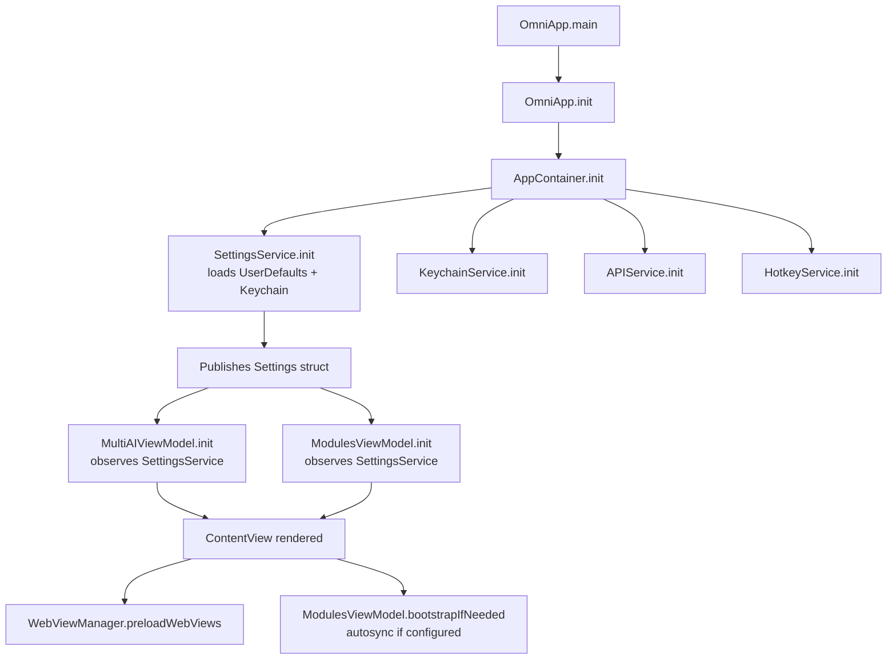
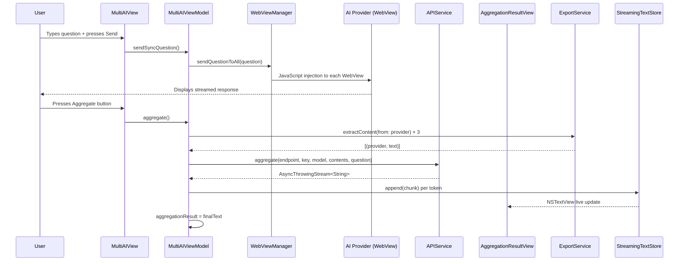
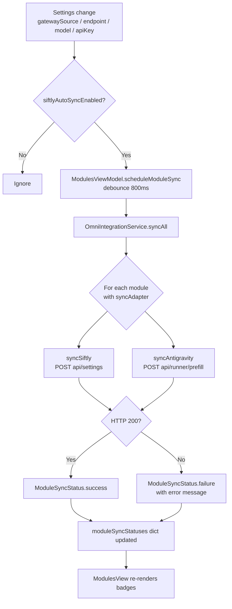

# Omni – Architecture Design Document

## Overview

Omni (formerly AggregateAI) is a macOS SwiftUI app that aggregates multiple AI providers (Gemini, Grok, ChatGPT) into a single workspace and manages local tool modules (Siftly, OmniRoute, Antigravity Debugger).

### Why This Redesign?

The original codebase accumulated several structural problems:

| Problem | Impact |
|---|---|
| `ContentView.swift` – 2,268 lines | Impossible to navigate; unrelated UI mixed together |
| `OmniIntegrationService.swift` – 1,626 lines | Business logic, data models, Docker, shell scripts all in one file |
| `AppState` with 40+ `@Published` properties | Unrelated concerns mutate each other; every view rebuilds on every change |
| Hardcoded paths (`/Users/xwx0316/...`) | App breaks on any other machine |
| Hardcoded `localhost` URLs | Cannot change ports without editing source code |
| No protocol abstractions | Cannot swap implementations, cannot write unit tests |

---

## Architecture Principles

### 1. MVVM + Feature Folders

Each feature (MultiAI, Modules, Settings) owns its ViewModel, View, and Models. No feature reaches directly into another feature's internals.

```
Features/
  MultiAI/
    MultiAIViewModel.swift   ← @MainActor ObservableObject, owns AI interaction state
    MultiAIView.swift        ← SwiftUI view, observes MultiAIViewModel
  Modules/
    ModulesViewModel.swift   ← @MainActor ObservableObject, owns module lifecycle state
    ModulesView.swift        ← SwiftUI view, observes ModulesViewModel
```

### 2. Dependency Injection via AppContainer

A single `AppContainer` creates all service singletons and passes them down to ViewModels. No view or ViewModel reaches for global singletons directly. This makes every component independently testable.

```
OmniApp
  └── AppContainer (creates services once)
        ├── SettingsService   (UserDefaults + Keychain)
        ├── APIService        (network calls, streaming)
        ├── KeychainService   (secure storage)
        └── HotkeyService     (global hotkey registration)
```

### 3. Single-Concern ViewModels

`AppState` is split into focused ViewModels that only publish what their views need:

| Old (monolithic AppState) | New (focused ViewModels) |
|---|---|
| All 40+ properties in one class | Each ViewModel owns ~8–12 properties |
| Every view rebuilds together | Views rebuild only when their own VM changes |
| Settings mixed with UI state | `SettingsService` owns persistence; VMs observe it |

### 4. SettingsService – Centralised Persistence

All UserDefaults / Keychain reads and writes go through `SettingsService`. It publishes a typed `Settings` value. ViewModels bind to the parts they need.

### 5. No Hardcoded Paths or URLs

- Module install paths default to empty `""` – the user must select them via `NSOpenPanel`
- All `localhost` service URLs default to configurable strings stored in `SettingsService`
- `OmniModuleRegistry` definitions reference `SettingsService` at runtime, not compile-time literals

---

## New Folder Structure

```
Omni/
├── Core/
│   ├── AppContainer.swift          ← DI root
│   └── Models/
│       └── SharedAISettings.swift  ← GatewaySource, SharedAISettingsSnapshot, module models
│
├── Features/
│   ├── MultiAI/
│   │   ├── MultiAIViewModel.swift  ← AI tab/layout/aggregation state
│   │   └── MultiAIView.swift       ← WebView grid + input bar
│   └── Modules/
│       ├── ModulesViewModel.swift  ← module sync/docker/update state
│       └── ModulesView.swift       ← module dashboard UI
│
├── Services/
│   ├── APIService.swift            ← (existing) OpenAI-compatible HTTP calls
│   ├── ClipboardMonitor.swift      ← (existing)
│   ├── ExportService.swift         ← (existing)
│   ├── KeychainService.swift       ← (existing)
│   ├── NotificationService.swift   ← (existing)
│   ├── ObsidianService.swift       ← (existing)
│   ├── OmniIntegrationService.swift← (existing, to be refactored later)
│   ├── SettingsService.swift       ← NEW: centralised settings persistence
│   └── TwitterCSSInjector.swift    ← (existing)
│
├── Settings/
│   ├── HotkeyRecorderView.swift    ← (existing)
│   ├── SettingsKeys.swift          ← (existing) key constants
│   └── SettingsView.swift          ← (existing)
│
├── AIProvider.swift
├── AggregationResultView.swift
├── AppDelegate.swift
├── ContentView.swift               ← (existing, to be replaced last)
├── OmniApp.swift
└── PersistentWebView.swift
```

---

## Flow Charts

### App Initialisation Flow



### User Input → AI Response Flow



### Module Sync Flow



### Settings Persistence Flow

```mermaid
flowchart LR
    A[User changes setting\nin SettingsView] --> B[SettingsService\n@Published settings updated]
    B --> C{Value type?}
    C -->|Plain value| D[OmniSettingsStore\nUserDefaults suite write]
    C -->|API Key / Endpoint Key| E[KeychainService\nsecure storage write]
    D --> F[Combine sink\ndropFirst to skip init]
    E --> F
    F --> G[SettingsService.settings publisher\nnotifies all subscribers]
    G --> H[MultiAIViewModel\nupdates gateway credentials]
    G --> I[ModulesViewModel\ntriggers autosync if needed]

    J[App launch] --> K[SettingsService.loadFromDefaults]
    K --> L[OmniSettingsStore.shared\nmigrates legacy domains]
    L --> M[KeychainService reads\nsecure values]
    M --> N[Settings struct published\nto all ViewModels]
```

---

## Key Architectural Decisions

### Decision 1: AppContainer over Environment Objects

Using a concrete `AppContainer` rather than injecting a dozen `@EnvironmentObject` values prevents the "any view can access anything" anti-pattern and makes dependency graphs explicit.

### Decision 2: Settings as a Value Type

`SettingsService` publishes a single `Settings` struct (value type). ViewModels receive immutable snapshots; they call mutating methods on the service rather than setting raw properties. This prevents accidental partial-update bugs.

### Decision 3: `StreamingTextStore` for Zero-Overhead Streaming

AI responses are streamed token by token. Routing every token through a `@Published` property would trigger SwiftUI diffing for every token. Instead, `StreamingTextStore` writes directly to an `NSTextView` via a Combine publisher, with a single `@Published` update only at completion (for save/export).

### Decision 4: No Hardcoded Install Paths

`OmniModuleRegistry` definitions no longer embed literal paths. Default URLs are stored in `SettingsService` with sensible `localhost` defaults. The install path is `""` until the user selects one via file picker. This makes the app usable by anyone, not just the original developer.

### Decision 5: Protocol Abstractions for Services

Each service exposes a protocol (`SettingsServiceProtocol`, `APIServiceProtocol`) so ViewModels accept the protocol type. Xcode Previews and unit tests can supply lightweight mock implementations without touching production code.

### Decision 6: Feature-based Folders over Layer-based

Feature folders (`Features/MultiAI/`, `Features/Modules/`) instead of layer folders (`ViewModels/`, `Views/`) keeps all code for a feature co-located. Adding, removing, or understanding a feature only requires looking in one directory.
